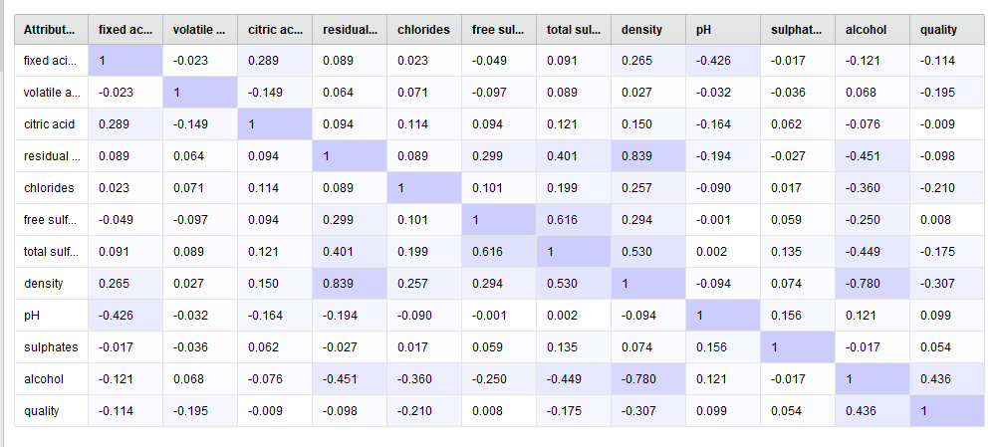

# Final-Project
Using Linear Regression and Decision Tree to determine wine quality based on chemical makeup

By Rachel Carlson and Nate McBarron

## Introduction
The purpose of this project was to create a machine learning model that could help wine makers and wine sellers classify wine quality based on a variety of chemical variables, such as Citric Acid level, Sulphates, and Alcohol Percentage. This would allow wine makers determine what the ideal chemical qualities of a good red or white wine are, in order produce wines that will be most highly rated by experts. Determining quality of wine will also help wine sellers decide how much to charge for certain wines without having to have an expensive professional wine tasting. We created two models to try and better understand what variables will have the most influence on red versus white wine quality, one Linear Regression Model and one Decision Tree Model. We also ran a correlation matric to determine how correlated the variables were with each other before creating our machine learning models. 
## Data Sets
We had two different data sets for this project, one that consisted all of Portuguese Red Wines and the other consisting of Portuguese White Wines. The White Wine data set had 4,898 different wines listed, while the Red Wines list had 1,599 wines listed. Each data set has twelve variables: Fixed Acidity, Volatile Acidity, Citric Acid, Residual Sugar, Chlorides, Free Sulfur Dioxide, Total Sulfur Dioxide, Density, pH, Sulphates, Alcohol Percentage and Quality. The values for all variables besides Quality are determined by testing the chemical properties of the wine. Quality was determined by ratings between 1 and 10, 1 being the lowest and 10 being the highest, given by professional wine tasters. 
#### Histogram Showing Quality Ratings for Red Wines

#### Histogram Showing Quality Ratings for White Wines

## Trained Models & Visualizations 

### Correlation Matrix

#### Red Wine Process and Result

#### White Wine Process and Result

### Linear Regression Models

#### Red Wine Linear Regression Process, Result and Squared Correlation

#### White Wine Linear Regression Process, Result and Squared Correlation

### Decision Tree Models 

#### Red Wine Decision Tree Process, Result and Squared Correlation

##### Close-Up of Decision Tree Portion

 TRAINING
 TESTING

#### White Wine Decision Tree Process, Result, and Squared Correlation 

 TRAINING
 TESTING

## Justification of Model Choices
We decided to use a Linear Regression model because it is easy to interpret the results of the model. It was able to show the realtionship that all of the different variables have on Quality. Since this model is designed for people who are likely unfamiliar with computing and machine learning, we decided the simpler the model was to understand, the better. The data we had also required a regression model instead of a classification model, so Linear Regression was one of our best options in this regard. We also decided to use a Decision Tree because the layout of the results would be an easy to follow, step-by-step process able to help winemakers to determine how to make the highest qulaity wine. 

## Conclusion
The results of our models were very interesting. Firstly, the Linear Regression models for both red and white wine were not very accurrate, with red wine having a squared correlation of .360 and white wine having a squared correlation of .282. The Decision Tree model also had problems; the red wine data was overfit for training, while white wine was altogether inaccurate with a squared correlation of .226 for testing and .208 for training. 

It is also interesting to note that of the variables present, the three most influential on Quality for red wine were different from those determined for white wine, according to the Linear Regression Model. Red wine's most influenetial values were Alcohol Percentage, Volitile Acidity, and Sulphates, while Residual Sugar and Density were altogether ignored as insignificant. The most influential variables on Quality for white wine were Density, Residual Sugar, and Alcohol Percentage. What this shows is that two of the variables that had the most impact on white wine quality do not appear to be nearly as important on the red wine quality, based on the model. 

The decision tree for the red wine data was massive, with many different steps determining level of wine Quality. The white wine decision tree was minimal, and only showed Alcohol Percentage and Volitile Acidity as being influential on Quality. This result is different from what the Linear Regression model showed, so there is obviously some kind of disconnect. This could possibly indicate that the models we made are unrelaible and inaccurate. 

It is also imporatant to note that wine tasting is not an exact science, so some varibales may be all over the board in determining what wine Quality is. For instance, the taster may have rated a red wine as a three, when previously he rated a wine with almost identical values as a six. This inconsistency makes it much harder for the models to determine a concrete way of rating wine, and is a serious limitation on the model's ability to accurately predict a Quality rating. Another limitation to this project was our lack of understanding about more regression models that can be used in Rapid Miner; there were only so many we could choose from. There may be other regression models that would work better for this type of issue, or a different program other than RapidMiner that would have more success. 

In order to improve these models, there would likely have to be a more standardized way of rating wine. The inconsistencies in wine rating wreak havoc on the machine learning models, so until a more concrete system for wine rating is devised it will be very difficult to create relaible and accurate models. It also may have improved the models if we had isolated specific variables in order to minimize redundancies. 
